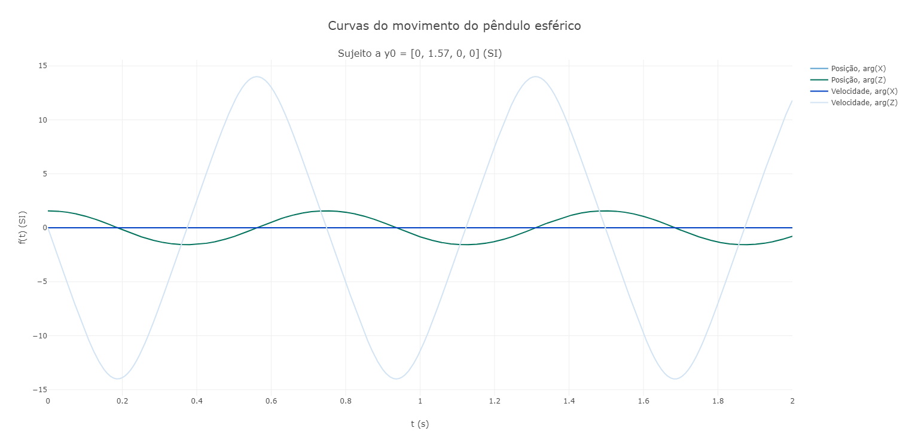

# Método de Euler

Esse repositório possui o método de Euler para solução de sistemas de equações diferenciais. Abaixo, temos alguns exemplos que podem ser resolvidos pelo método de Euler. O código de cada exemplo está em "exemplos.py".

## 1) Equação do pêndulo esférico (pêndulo tridimensional):

Seja um pêndulo de massa $m$ preso a uma corda inextensiva de comprimento $l$ sob força gravitacional $g$. Então, a equação que modela seu movimento satisfaz:

$$
\begin{equation}
  \begin{cases}
    \ddot{\phi}(t) = - 2 \cot(\theta) \dot{\phi} \dot{\theta} \\
    \newline
    \ddot{\theta}(t) = \dot{\phi}^2 \sin(\theta) \cos(\theta) - \dfrac{g}{l} \sin(\theta)
  \end{cases}
\end{equation}
$$

**Demonstração:**

Por meio da mecânica lagrangiana, estabelece-se o lagrangiano conforme

$$
\begin{equation}
  \mathcal{L} = T - V : \textrm{    } - \nabla{V} = \displaystyle\sum_\textrm{conservativas} \mathbf{F} = mg \hat{z}
\end{equation}
$$

Perceba que o eixo z está para baixo e que o caminho tomado pelo pêndulo é de $z_0$ a $z$. Sendo assim, define-se $V_0$ da seguinte forma

$$
\begin{equation}
  V(z=l) = 0 \Longleftrightarrow V_0 = mg(l-z_0)
\end{equation}
$$

Portanto, o lagrangiano fica

$$
\begin{equation}
  \mathcal{L} = \dfrac{m \dot{\mathbf{s}} \cdot \dot{\mathbf{s}}}{2} - mg(z-l)
\end{equation}
$$

Por tratar-se de mecânica lagrangiana, basta determinar as coordenadas generalizadas do sistema. Nesse caso, já que o problema possui simetria esférica, escolhe-se as coordenadas esféricas.

$$
\begin{equation}
  \dot{\mathbf{s}} = \begin{pmatrix} x \\ 
  y \\ 
  z \end{pmatrix} = \begin{pmatrix} x(\phi(t), \theta(t)) \\ 
  y(\phi(t), \theta(t)) \\ 
  z(\phi(t), \theta(t)) \end{pmatrix} = l \cdot \begin{pmatrix} \sin(\theta) \cos(\phi) \\ 
  \sin(\theta) \sin(\phi) \\ 
  \cos(\theta) \end{pmatrix}
\end{equation}
$$

Perceba que tanto $\phi$ e $\theta$ são suficientes para descrever o fenômeno proposto. Por fim, por meio das equações de Euler-Lagrange, conclui-se

$$
\begin{equation}
  \begin{cases}
    \ddot{\phi}(t) = - 2 \cot(\theta) \dot{\phi} \dot{\theta} \\
    \newline
    \ddot{\theta}(t) = \dot{\phi}^2 \sin(\theta) \cos(\theta) - \dfrac{g}{l} \sin(\theta)
  \end{cases}
\end{equation}
$$

**Solução Numérica**

Exemplo gráfico de solução numérica.

## 2) Equações de circuitos RLC:

Seja um circuito RLC em série alimentado por uma fonte de tensão que $V(t)$. Então, ele pode ser descrito conforme

$$
\begin{equation}
  \begin{cases}
    \dot{I}(t) = \dfrac{V(t) - I(t)R - V_C(t)}{L} \\
    \newline
    \dot{V_C}(t) = \dfrac{I(t)}{C}
  \end{cases}
\end{equation}
$$

**Demonstração:**

A partir da Lei de Kirchhoff de Tensões e das equações do capacitor e indutor, pode-se concluir a afirmação.

**Solução Numérica**

Exemplo gráfico de solução numérica.

## 3) Equações de Euler para Corpos Rígidos:

### Em desenvolvimento.

**Demonstração:**

### Em desenvolvimento.

**Solução Numérica**

### Em desenvolvimento.