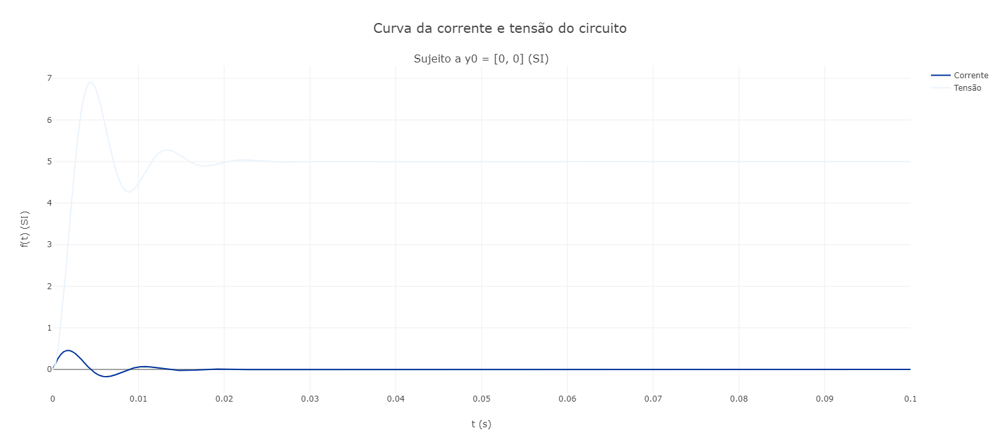

# Método de Euler

Esse repositório possui o método de Euler para solução de sistemas de equações diferenciais. Abaixo, temos alguns exemplos que podem ser resolvidos pelo método de Euler. O código de cada exemplo está em "exemplos.py".

## 1) Equação do pêndulo esférico (pêndulo tridimensional):

Seja um pêndulo de massa $m$ preso a uma corda inextensiva de comprimento $l$. Então, a equação que modela seu movimento satisfaz:

### Em desenvolvimento.

**Demonstração:**

### Em desenvolvimento.

**Solução Numérica**

### Em desenvolvimento.

## 2) Equações de circuitos RLC.

Seja um circuito RLC em série alimentado por uma fonte de tensão que $V(t)$. Então, ele pode ser descrito conforme

$$
\begin{equation}
  \begin{cases}
    \dot{I}(t) = \dfrac{V(t) - I(t)R - V_C(t)}{L} \\
    \newline
    \dot{V_C}(t) = \dfrac{I(t)}{C}
  \end{cases}
\end{equation}
$$

**Demonstração:**

A partir da Lei de Kirchhoff de Tensões e das equações do capacitor e indutor, pode-se concluir a afirmação.

**Solução Numérica**

## 3) Equações de Euler para Corpos Rígidos:

### Em desenvolvimento.

**Demonstração:**

### Em desenvolvimento.

**Solução Numérica**

### Em desenvolvimento.